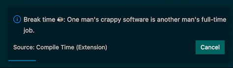

# Compile Time README

As a programmer, I very often find myself sitting for hours on end without taking a break or worse, without drinking water. That's why I decided to create **Compile Time**, an extension to help you and me to remember take those crucial breaks that are good for our physical and mental health.

## Features

Compile Time will remind you to take a brak with funny geek quotes in an interval you define the first time you use the extension.

## Extension Settings

At any time you can change your interval preferrence and break duration. You just simple run any of the following commands and enter the value in minutes.

For example run `Shift+CMD+P` on macOS or `Shift+Ctrl+P` on (Windows and Linux) and type:

- `takeabreak.set.interval.alert`: will set your alert interval
- `takeabreak.set.interval.break`: will set your break time (5 minutes by default)

## Known Issues

...

## Release Notes

### 1.0.0

Initial release of Compile Time

**Enjoy!**
